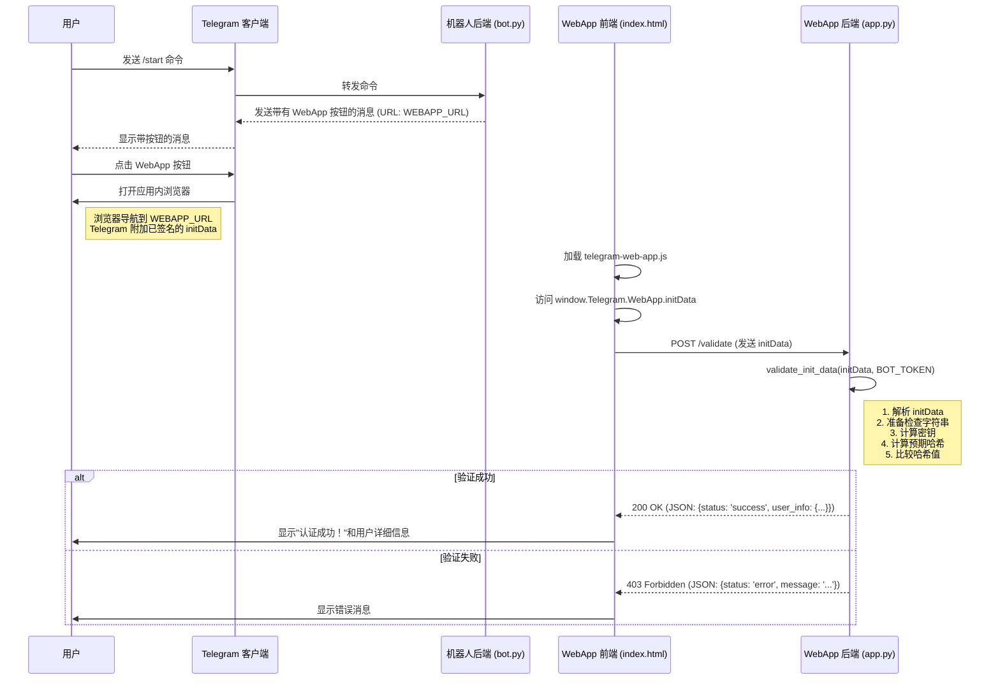
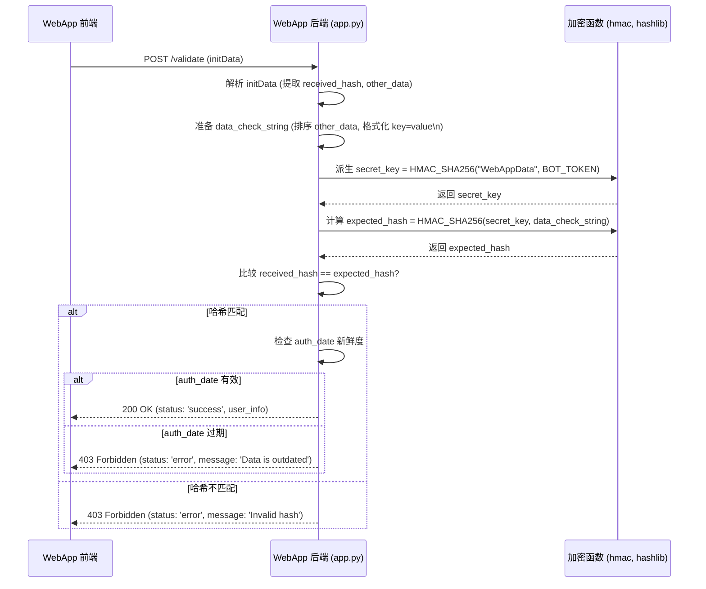

# Telegram WebApp 安全认证示例

本项目演示了如何使用 `WebAppInitData` 机制，在一个从 Telegram 机器人启动的 Web 应用程序中安全地认证 Telegram 用户。

它使用了：
*   `pyTelegramBotAPI` 用于 Telegram 机器人。
*   `Flask` 用于简单的 Web 应用程序后端。
*   `python-dotenv` 用于管理环境变量。
*   标准 Python 库（`hmac`, `hashlib`, `json`, `urllib`）用于验证。

## 工作原理

1.  **用户交互：** 用户向 Telegram 机器人发送 `/start` 或 `/login` 命令。
2.  **机器人响应：** 机器人回复一条消息，其中包含一个内联按钮，该按钮配置了指向我们 Web 应用程序的 `WebAppInfo` URL。
3.  **WebApp 启动：** 用户点击按钮。Telegram 在应用内浏览器中打开指定的 URL，并传递包含用户信息的、经过加密签名的 `initData`。
4.  **前端 (`index.html`)：** 网页加载，使用 `telegram-web-app.js` 库访问 `window.Telegram.WebApp.initData`，并将此数据发送到后端 `/validate` 端点。
5.  **后端 (`app.py`)：** Flask 应用程序在 `/validate` 端点接收 `initData`。它使用秘密的 `TELEGRAM_BOT_TOKEN` 执行 HMAC-SHA256 验证，以确保数据是真实的且未被篡改。
6.  **认证结果：** 如果验证成功，后端返回成功响应和解析后的用户信息。前端显示此结果。如果验证失败，则返回 403 Forbidden 错误。



## 设置

1.  **克隆仓库（或按说明创建文件）。**

2.  **创建 Telegram 机器人：**
    *   在 Telegram 上与 `@BotFather` 对话。
    *   使用 `/newbot` 创建一个新机器人。
    *   记下 BotFather 提供的 **HTTP API 令牌**。

3.  **设置环境变量：**
    *   在项目的根目录（`bot.py` 所在的位置）创建一个名为 `.env` 的文件。
    *   将以下行添加到 `.env` 文件中，替换占位符：
        ```dotenv
        TELEGRAM_BOT_TOKEN="在此处填入您的机器人令牌"
        # 本地测试使用 ngrok 的示例：
        WEBAPP_URL="https://your-unique-ngrok-subdomain.ngrok-free.app"
        ```
    *   **重要提示：** `WEBAPP_URL` 必须是 HTTPS。

4.  **暴露您的 Web 应用（用于本地开发）：**
    *   由于 Telegram 客户端需要通过 HTTPS 访问您的 Web 应用，因此如果在本地运行，您需要像 `ngrok` 这样的工具。
    *   安装 ngrok: [https://ngrok.com/download](https://ngrok.com/download)
    *   运行 ngrok 以暴露您的 Flask 应用将运行的端口（在 `webapp/app.py` 中默认为 5001）：
        ```bash
        ngrok http 5001
        ```
    *   Ngrok 将为您提供一个 HTTPS 转发 URL（例如，`https://abcdef123456.ngrok-free.app`）。在 `.env` 文件中使用此 URL 作为您的 `WEBAPP_URL`。

5.  **安装依赖：**
    ```bash
    pip install -r requirements.txt
    ```

## 运行示例

1.  **启动 Web 应用程序：**
    *   导航到 `webapp` 目录：
        ```bash
        cd webapp
        ```
    *   运行 Flask 应用：
        ```bash
        python app.py
        ```
    *   保持此终端运行。

2.  **启动 Telegram 机器人：**
    *   打开一个*新*终端。
    *   导航回项目根目录（如果您更改了目录）：
        ```bash
        cd ..
        ```
    *   运行机器人脚本：
        ```bash
        python bot.py
        ```
    *   保持此终端运行。

3.  **在 Telegram 中测试：**
    *   打开 Telegram 并找到您创建的机器人。
    *   发送 `/start` 命令。
    *   点击 "Open Web App 🔐" 按钮。
    *   Web 应用应在 Telegram 内打开，尝试进行验证，并显示成功消息（包含您的用户信息）或错误消息。

## 后续步骤

用户通过身份验证后，您可以在 `webapp/app.py` 后端使用经过验证的 `user_info`（尤其是 `id`）来执行以下操作：

*   **创建会话：** 使用 Flask 的会话管理（或其他方法，如 JWT）来保持用户在该会话期间对您的 Web 应用的后续请求保持登录状态。
*   **用户数据库：** 在您的应用程序数据库中查找 Telegram 用户 ID。如果用户存在，则将其登录。如果不存在，您可以提示他们完成注册过程，将他们的 Telegram ID 关联到您系统中的新帐户或现有帐户。
*   **个性化：** 使用用户的名字、姓氏或语言代码（如果 `user_info` 中可用）来个性化 Web 应用体验。
*   **API 调用：** 存储用户的 ID，以将他们在 Web 应用中执行的操作（例如保存数据）与其身份相关联。

请记住处理潜在的错误，例如即使哈希验证通过，`user_info` 也可能丢失或不完整的情况。

## 安全说明：使用 HMAC 验证数据真实性

Telegram Web App 身份验证的安全性取决于验证您的后端收到的 `initData` 字符串确实源自 Telegram 并且未被篡改。此验证使用**基于哈希的消息认证码 (HMAC)**，特别是 HMAC-SHA256。

以下是此过程如何确认数据来源和完整性的详细说明：

1.  **共享密钥：** 此安全模型的基础是您的 **`TELEGRAM_BOT_TOKEN`**。此令牌*只有*您（您的后端服务器）和 Telegram 知道。必须绝对保密。

2.  **Telegram 进行数据签名：** 当用户启动您的 Web 应用时，Telegram 会准备 `initData` 字符串。在发送之前，Telegram 执行以下步骤：
    *   收集 `initData` 中除 `hash` 本身之外的所有键值对。
    *   按键的字母顺序对这些键值对进行排序（例如，`auth_date=...`, `query_id=...`, `user=...`）。
    *   将它们格式化为单个字符串，每对占一行 (`key=value\nkey=value...`)。我们称之为 `data-check-string`。
    *   使用 HMAC 专门为此验证派生一个密钥：`secret_key = HMAC_SHA256("WebAppData", TELEGRAM_BOT_TOKEN)`。
    *   通过再次使用派生的 `secret_key` 和 `data-check-string` 应用 HMAC-SHA256 来计算最终签名（`hash`）：`generated_hash = HMAC_SHA256(secret_key, data-check-string)`。
    *   Telegram 将此 `generated_hash` 附加到 `initData` 中的 `hash` 键下，并将完整的 `initData` 字符串发送到用户的客户端，然后由客户端转发到您的后端。

3.  **服务器端验证（您的后端）：** 当您的 `/validate` 端点收到 `initData` 时，它必须执行*完全相同的步骤*来重新计算哈希值：
    *   **解析 `initData`：** 提取收到的 `hash` 和所有其他键值对。
    *   **重建 `data-check-string`：** 删除收到的 `hash` 对，按键的字母顺序对其余键值对进行排序，并使用换行符连接它们，精确匹配 Telegram 的格式。
    *   **派生 `secret_key`：** 使用*您*存储的 `TELEGRAM_BOT_TOKEN`（共享密钥）计算完全相同的密钥：`secret_key = HMAC_SHA256("WebAppData", YOUR_BOT_TOKEN)`。
    *   **计算预期哈希：** 使用派生的 `secret_key` 和重建的 `data-check-string` 计算哈希值：`expected_hash = HMAC_SHA256(secret_key, reconstructed_data_check_string)`。
    *   **比较哈希值：** 严格比较您的服务器刚刚计算的 `expected_hash` 与 `initData` 中收到的 `hash`。

4.  **判定结果：**
    *   **匹配：** 如果 `expected_hash == received_hash`，则通过密码学证明：
        *   **真实性：** 数据*必须*源自 Telegram 且是为*您的特定机器人*生成的。只有知道正确的 `TELEGRAM_BOT_TOKEN` 的 Telegram 才能计算出生成该特定 `data-check-string` 的有效 `hash` 所需的正确 `secret_key`。没有令牌的攻击者无法伪造此哈希。
        *   **完整性：** 自 Telegram 签名以来，数据未被更改。对用户数据、`auth_date` 或其他字段的任何修改都会更改 `data-check-string`，从而导致不同的 `expected_hash`，该哈希将*不*匹配 `received_hash`。
    *   **不匹配：** 如果哈希值不匹配，则数据被视为无效——要么它不是来自 Telegram，要么它已被篡改，要么您的验证逻辑（例如，字符串格式化）不正确。您的服务器应拒绝该请求（例如，返回 403 Forbidden 状态）。

5.  **时间戳检查（重放攻击预防）：** 虽然 HMAC 确认了*签名时*的真实性和完整性，但它不能阻止攻击者重放旧的、有效的 `initData` 字符串。因此，您的后端还应检查已验证数据中的 `auth_date` 字段（Unix 时间戳）。确保此时间戳是合理近期的（例如，在几分钟或几小时内，具体取决于您的应用程序的容忍度），以减轻重放攻击。本示例在 `webapp/app.py` 的 `validate_init_data` 中包含了一天内的新鲜度检查。

**总结：** 安全性依赖于 HMAC-SHA256 算法和您的 `TELEGRAM_BOT_TOKEN` 的机密性。通过成功地重新计算 Telegram 生成的相同哈希值，您的服务器可以验证数据是真实的（来自 Telegram）、未修改的，并且与您的特定机器人相关联。

### 后端验证流程 (`/validate` 端点)



## 后续步骤

用户通过身份验证后，您可以在 `webapp/app.py` 后端使用经过验证的 `user_info`（尤其是 `id`）来执行以下操作：

*   **创建会话：** 使用 Flask 的会话管理（或其他方法，如 JWT）来保持用户在该会话期间对您的 Web 应用的后续请求保持登录状态。
*   **用户数据库：** 在您的应用程序数据库中查找 Telegram 用户 ID。如果用户存在，则将其登录。如果不存在，您可以提示他们完成注册过程，将他们的 Telegram ID 关联到您系统中的新帐户或现有帐户。
*   **个性化：** 使用用户的名字、姓氏或语言代码（如果 `user_info` 中可用）来个性化 Web 应用体验。
*   **API 调用：** 存储用户的 ID，以将他们在 Web 应用中执行的操作（例如保存数据）与其身份相关联。

请记住处理潜在的错误，例如即使哈希验证通过，`user_info` 也可能丢失或不完整的情况。

## 安全说明

Telegram Web App 身份验证的安全性依赖于 `initData` 字符串中提供的 `hash` 字段以及您的 `TELEGRAM_BOT_TOKEN` 的保密性。以下是其安全原因的细分：

1.  **数据签名：** 启动 Web 应用时，Telegram 会生成一个唯一的 `hash` 字符串。此哈希是通过以下方式创建的：
    *   收集 `initData` 中的所有其他数据字段（如 `user`、`auth_date` 等）。
    *   按键的字母顺序对这些字段进行排序。
    *   将它们格式化为特定的字符串格式（例如，`key1=value1\nkey2=value2...`）。
    *   使用从您的 `TELEGRAM_BOT_TOKEN` 派生的密钥计算此字符串的 HMAC-SHA256 签名。

2.  **服务器端验证：** 您的后端服务器（在此示例中为 `webapp/app.py`）接收包含 `hash` 的 `initData` 字符串。为了验证其真实性，服务器必须：
    *   **绝对保密 `TELEGRAM_BOT_TOKEN`。** 绝不能在客户端或公共仓库中暴露它。
    *   完全按照 Telegram 的方式重建数据字符串（通过删除 `hash` 字段，对其余键值对进行排序，并用换行符连接它们）。
    *   使用 HMAC 从 `TELEGRAM_BOT_TOKEN` 派生相同的密钥 (`HMAC(bot_token, "WebAppData")`)。
    *   使用派生的密钥和重建的数据字符串计算其自己的预期 HMAC-SHA256 哈希。
    *   **比较**从客户端收到的 `hash` 与服务器上计算的哈希。

3.  **完整性和真实性：**
    *   如果哈希值匹配，则证明了两件事：
        *   **真实性：** 数据确实源自 Telegram 且是为*您的特定机器人*生成的，因为只有 Telegram 和您的服务器（知道秘密的 `TELEGRAM_BOT_TOKEN`）才能生成正确的哈希。
        *   **完整性：** 自 Telegram 生成数据以来，数据未被篡改。对数据字段的任何修改都会导致不同的重建字符串，从而导致哈希不匹配。

4.  **时间戳检查（可选但推荐）：** 应在服务器上检查 `initData` 中包含的 `auth_date` 字段（Unix 时间戳），以确保验证请求是近期的，防止可能重用旧的、被截获的 `initData` 字符串的重放攻击。本示例在 `webapp/app.py` 中的 `validate_init_data` 中包含了新鲜度检查。

**总结：** 只要您的 `TELEGRAM_BOT_TOKEN` 保持机密，加密签名（HMAC-SHA256 哈希）就能确保您的 Web 应用程序后端收到的用户数据是真实且未修改的。 