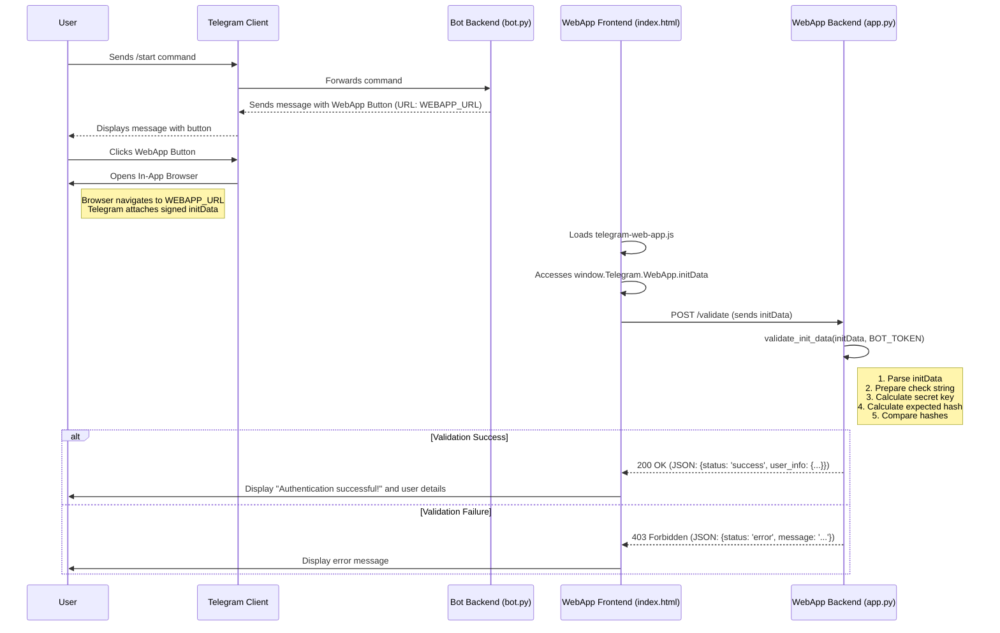

# Telegram WebApp Secure Authentication Example

This project demonstrates how to securely authenticate a Telegram user in a web application launched from a Telegram bot using the `WebAppInitData` mechanism.

It uses:
*   `pyTelegramBotAPI` for the Telegram bot.
*   `Flask` for the simple web application backend.
*   `python-dotenv` for managing environment variables.
*   Standard Python libraries (`hmac`, `hashlib`, `json`, `urllib`) for validation.

## How it Works

1.  **User Interaction:** The user sends `/start` or `/login` to the Telegram bot.
2.  **Bot Response:** The bot replies with a message containing an inline button configured with a `WebAppInfo` URL pointing to our web application.
3.  **WebApp Launch:** The user clicks the button. Telegram opens the specified URL in an in-app browser and passes cryptographically signed `initData` containing user information.
4.  **Frontend (`index.html`):** The web page loads, uses the `telegram-web-app.js` library to access `window.Telegram.WebApp.initData`, and sends this data to the backend `/validate` endpoint.
5.  **Backend (`app.py`):** The Flask application receives the `initData` at the `/validate` endpoint. It performs HMAC-SHA256 validation using the secret `TELEGRAM_BOT_TOKEN` to ensure the data is authentic and hasn't been tampered with.
6.  **Authentication Result:** If validation succeeds, the backend responds with success and the parsed user information. The frontend displays this result. If validation fails, a 403 Forbidden error is returned.



## Setup

1.  **Clone the repository (or create the files as provided).**

2.  **Create a Telegram Bot:**
    *   Talk to `@BotFather` on Telegram.
    *   Create a new bot using `/newbot`.
    *   Note down the **HTTP API token** provided by BotFather.

3.  **Set up Environment Variables:**
    *   Create a file named `.env` in the project's root directory (where `bot.py` is).
    *   Add the following lines to `.env`, replacing the placeholders:
        ```dotenv
        TELEGRAM_BOT_TOKEN="YOUR_BOT_TOKEN_HERE" 
        # Example using ngrok for local testing:
        WEBAPP_URL="https://your-unique-ngrok-subdomain.ngrok-free.app"
        ```
    *   **Important:** The `WEBAPP_URL` must be HTTPS.

4.  **Expose Your Web App (for Local Development):**
    *   Since the Telegram client needs to access your web app via HTTPS, you'll need a tool like `ngrok` if running locally.
    *   Install ngrok: [https://ngrok.com/download](https://ngrok.com/download)
    *   Run ngrok to expose the port your Flask app will run on (default is 5001 in `webapp/app.py`):
        ```bash
        ngrok http 5001
        ```
    *   Ngrok will give you an HTTPS forwarding URL (e.g., `https://abcdef123456.ngrok-free.app`). Use this URL as your `WEBAPP_URL` in the `.env` file.

5.  **Install Dependencies:**
    ```bash
    pip install -r requirements.txt
    ```

## Running the Example

1.  **Start the Web Application:**
    *   Navigate to the `webapp` directory:
        ```bash
        cd webapp
        ```
    *   Run the Flask app:
        ```bash
        python app.py 
        ```
    *   Keep this terminal running.

2.  **Start the Telegram Bot:**
    *   Open a *new* terminal.
    *   Navigate back to the project root directory (if you changed directory):
        ```bash
        cd ..
        ```
    *   Run the bot script:
        ```bash
        python bot.py
        ```
    *   Keep this terminal running.

3.  **Test in Telegram:**
    *   Open Telegram and find the bot you created.
    *   Send the `/start` command.
    *   Click the "Open Web App 🔐" button.
    *   The web app should open inside Telegram, attempt validation, and show either a success message with your user info or an error message.

## Next Steps

Once the user is authenticated, you can use the validated `user_info` (especially the `id`) in your `webapp/app.py` backend to:

*   **Create a Session:** Use Flask's session management (or another method like JWT) to keep the user logged in for subsequent requests to your web app within that session.
*   **User Database:** Look up the Telegram user ID in your application's database. If the user exists, log them in. If not, you might prompt them to complete a registration process, linking their Telegram ID to a new or existing account in your system.
*   **Personalization:** Use the user's first name, last name, or language code (if available in `user_info`) to personalize the web app experience.
*   **API Calls:** Store the user's ID to associate actions they take within the web app (like saving data) with their identity.

Remember to handle potential errors, such as when `user_info` might be missing or incomplete even if the hash validation passed.

## Security Note

The security of this method relies entirely on keeping your `TELEGRAM_BOT_TOKEN` secret. If your token is compromised, an attacker could forge validation requests. 