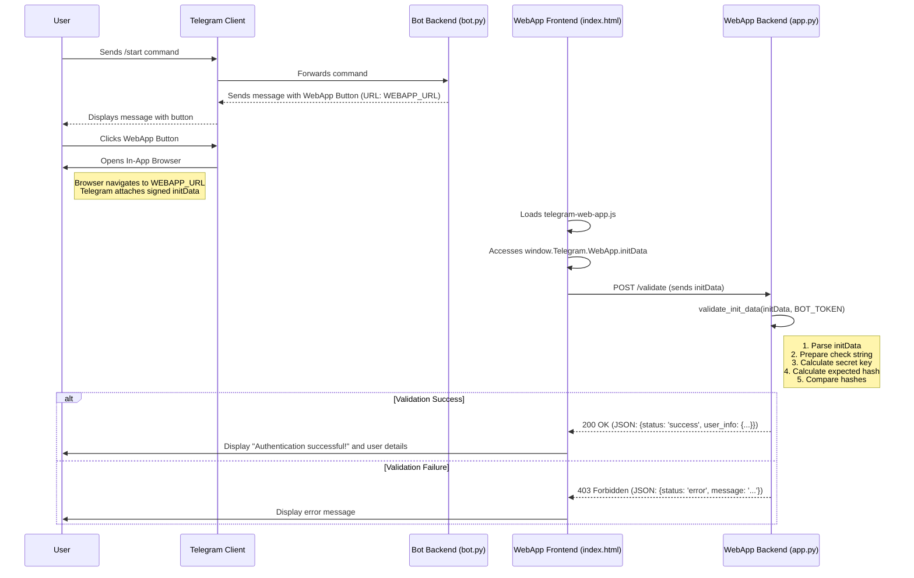
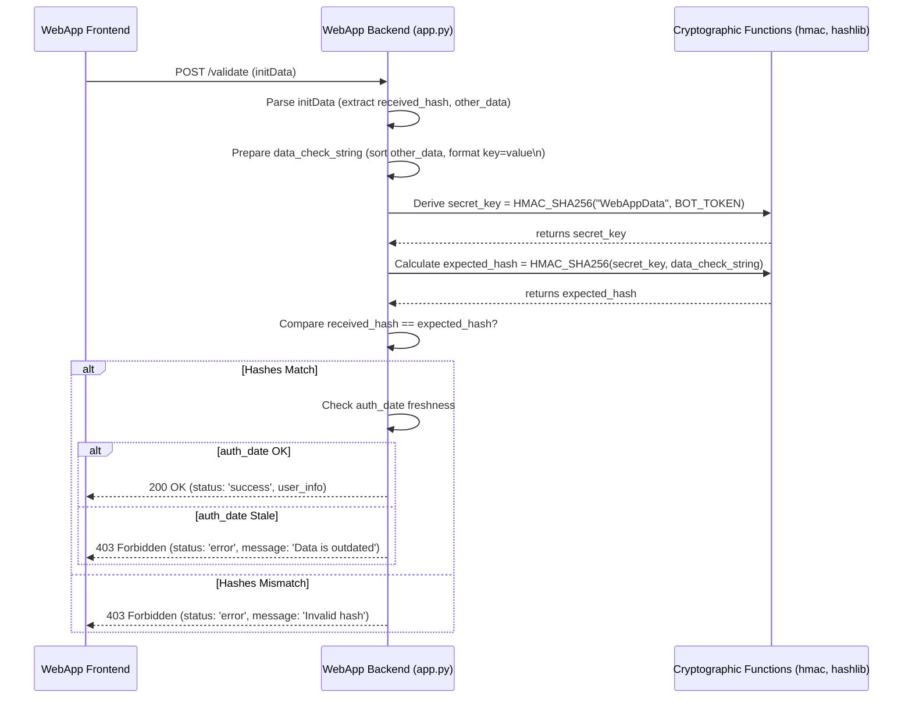

# Telegram WebApp Secure Authentication Example

This project demonstrates how to securely authenticate a Telegram user in a web application launched from a Telegram bot using the `WebAppInitData` mechanism.

It uses:
*   `pyTelegramBotAPI` for the Telegram bot.
*   `Flask` for the simple web application backend.
*   `python-dotenv` for managing environment variables.
*   Standard Python libraries (`hmac`, `hashlib`, `json`, `urllib`) for validation.

## How it Works

1.  **User Interaction:** The user sends `/start` or `/login` to the Telegram bot.
2.  **Bot Response:** The bot replies with a message containing an inline button configured with a `WebAppInfo` URL pointing to our web application.
3.  **WebApp Launch:** The user clicks the button. Telegram opens the specified URL in an in-app browser and passes cryptographically signed `initData` containing user information.
4.  **Frontend (`index.html`):** The web page loads, uses the `telegram-web-app.js` library to access `window.Telegram.WebApp.initData`, and sends this data to the backend `/validate` endpoint.
5.  **Backend (`app.py`):** The Flask application receives the `initData` at the `/validate` endpoint. It performs HMAC-SHA256 validation using the secret `TELEGRAM_BOT_TOKEN` to ensure the data is authentic and hasn't been tampered with.
6.  **Authentication Result:** If validation succeeds, the backend responds with success and the parsed user information. The frontend displays this result. If validation fails, a 403 Forbidden error is returned.



## Setup

1.  **Clone the repository (or create the files as provided).**

2.  **Create a Telegram Bot:**
    *   Talk to `@BotFather` on Telegram.
    *   Create a new bot using `/newbot`.
    *   Note down the **HTTP API token** provided by BotFather.

3.  **Set up Environment Variables:**
    *   Create a file named `.env` in the project's root directory (where `bot.py` is).
    *   Add the following lines to `.env`, replacing the placeholders:
        ```dotenv
        TELEGRAM_BOT_TOKEN="YOUR_BOT_TOKEN_HERE" 
        # Example using ngrok for local testing:
        WEBAPP_URL="https://your-unique-ngrok-subdomain.ngrok-free.app"
        ```
    *   **Important:** The `WEBAPP_URL` must be HTTPS.

4.  **Expose Your Web App (for Local Development):**
    *   Since the Telegram client needs to access your web app via HTTPS, you'll need a tool like `ngrok` if running locally.
    *   Install ngrok: [https://ngrok.com/download](https://ngrok.com/download)
    *   Run ngrok to expose the port your Flask app will run on (default is 5001 in `webapp/app.py`):
        ```bash
        ngrok http 5001
        ```
    *   Ngrok will give you an HTTPS forwarding URL (e.g., `https://abcdef123456.ngrok-free.app`). Use this URL as your `WEBAPP_URL` in the `.env` file.

5.  **Install Dependencies:**
    ```bash
    pip install -r requirements.txt
    ```

## Running the Example

1.  **Start the Web Application:**
    *   Navigate to the `webapp` directory:
        ```bash
        cd webapp
        ```
    *   Run the Flask app:
        ```bash
        python app.py 
        ```
    *   Keep this terminal running.

2.  **Start the Telegram Bot:**
    *   Open a *new* terminal.
    *   Navigate back to the project root directory (if you changed directory):
        ```bash
        cd ..
        ```
    *   Run the bot script:
        ```bash
        python bot.py
        ```
    *   Keep this terminal running.

3.  **Test in Telegram:**
    *   Open Telegram and find the bot you created.
    *   Send the `/start` command.
    *   Click the "Open Web App 🔐" button.
    *   The web app should open inside Telegram, attempt validation, and show either a success message with your user info or an error message.

## Next Steps

Once the user is authenticated, you can use the validated `user_info` (especially the `id`) in your `webapp/app.py` backend to:

*   **Create a Session:** Use Flask's session management (or another method like JWT) to keep the user logged in for subsequent requests to your web app within that session.
*   **User Database:** Look up the Telegram user ID in your application's database. If the user exists, log them in. If not, you might prompt them to complete a registration process, linking their Telegram ID to a new or existing account in your system.
*   **Personalization:** Use the user's first name, last name, or language code (if available in `user_info`) to personalize the web app experience.
*   **API Calls:** Store the user's ID to associate actions they take within the web app (like saving data) with their identity.

Remember to handle potential errors, such as when `user_info` might be missing or incomplete even if the hash validation passed.

## Security Note: Verifying Data Authenticity with HMAC

The security of the Telegram Web App authentication hinges on verifying that the `initData` string received by your backend genuinely originates from Telegram and hasn't been tampered with. This verification uses a **Hash-based Message Authentication Code (HMAC)**, specifically HMAC-SHA256.

Here's a breakdown of how this process confirms the data's origin and integrity:

1.  **The Shared Secret:** The foundation of this security model is your **`TELEGRAM_BOT_TOKEN`**. This token is known *only* to you (your backend server) and Telegram. It must be kept absolutely confidential.

2.  **Data Signing by Telegram:** When a user launches your Web App, Telegram prepares the `initData` string. Before sending it, Telegram performs these steps:
    *   It collects all the key-value pairs intended for `initData`, *except* for the `hash` itself.
    *   It sorts these pairs alphabetically by key (e.g., `auth_date=...`, `query_id=...`, `user=...`).
    *   It formats them into a single string with each pair on a new line (`key=value\nkey=value...`). Let's call this the `data-check-string`.
    *   It derives a secret key specifically for this validation using HMAC: `secret_key = HMAC_SHA256("WebAppData", TELEGRAM_BOT_TOKEN)`.
    *   It calculates the final signature (the `hash`) by applying HMAC-SHA256 again using the derived `secret_key` and the `data-check-string`: `generated_hash = HMAC_SHA256(secret_key, data-check-string)`.
    *   Telegram attaches this `generated_hash` to the `initData` under the `hash` key and sends the complete `initData` string to the user's client, which then forwards it to your backend.

3.  **Server-Side Verification (Your Backend):** When your `/validate` endpoint receives the `initData`, it must perform the *exact same steps* to recalculate the hash:
    *   **Parse `initData`:** Extract the received `hash` and all other key-value pairs.
    *   **Reconstruct `data-check-string`:** Remove the received `hash` pair, sort the remaining pairs alphabetically by key, and join them with newline characters, precisely matching Telegram's format.
    *   **Derive `secret_key`:** Use *your* stored `TELEGRAM_BOT_TOKEN` (the shared secret) to calculate the exact same secret key: `secret_key = HMAC_SHA256("WebAppData", YOUR_BOT_TOKEN)`.
    *   **Calculate Expected Hash:** Calculate the hash using the derived `secret_key` and the reconstructed `data-check-string`: `expected_hash = HMAC_SHA256(secret_key, reconstructed_data_check_string)`.
    *   **Compare Hashes:** Critically compare the `expected_hash` your server just calculated with the `hash` received within the `initData`.

4.  **The Verdict:**
    *   **Match:** If `expected_hash == received_hash`, it cryptographically proves:
        *   **Authenticity:** The data *must* have originated from Telegram for *your specific bot*. Only Telegram, knowing the correct `TELEGRAM_BOT_TOKEN`, could compute the correct `secret_key` needed to generate the valid `hash` for that specific `data-check-string`. An attacker without the token cannot forge this.
        *   **Integrity:** The data has not been altered since Telegram signed it. Any modification to the user data, `auth_date`, or other fields would change the `data-check-string`, resulting in a different `expected_hash` that would *not* match the `received_hash`.
    *   **Mismatch:** If the hashes do not match, the data is considered invalid – either it didn't come from Telegram, or it was tampered with, or your validation logic (e.g., string formatting) is incorrect. Your server should reject the request (e.g., return a 403 Forbidden status).

5.  **Timestamp Check (Replay Prevention):** While HMAC confirms authenticity and integrity *at the time of signing*, it doesn't prevent an attacker from replaying an old, valid `initData` string. Therefore, your backend should also check the `auth_date` field (a Unix timestamp) within the validated data. Ensure this timestamp is reasonably recent (e.g., within a few minutes or hours, depending on your application's tolerance) to mitigate replay attacks. This example includes a check for freshness within one day in `validate_init_data` in `webapp/app.py`.

**In Summary:** The security relies on the HMAC-SHA256 algorithm and the confidentiality of your `TELEGRAM_BOT_TOKEN`. By successfully recalculating the same hash that Telegram generated, your server verifies that the data is authentic (from Telegram), unmodified, and associated with your specific bot.

### Backend Validation Flow (`/validate` endpoint)



## Next Steps

Once the user is authenticated, you can use the validated `user_info` (especially the `id`) in your `webapp/app.py` backend to:

*   **Create a Session:** Use Flask's session management (or another method like JWT) to keep the user logged in for subsequent requests to your web app within that session.
*   **User Database:** Look up the Telegram user ID in your application's database. If the user exists, log them in. If not, you might prompt them to complete a registration process, linking their Telegram ID to a new or existing account in your system.
*   **Personalization:** Use the user's first name, last name, or language code (if available in `user_info`) to personalize the web app experience.
*   **API Calls:** Store the user's ID to associate actions they take within the web app (like saving data) with their identity.

Remember to handle potential errors, such as when `user_info` might be missing or incomplete even if the hash validation passed.

## Security Note

The security of the Telegram Web App authentication relies on the `hash` field provided within the `initData` string and the secrecy of your `TELEGRAM_BOT_TOKEN`. Here's a breakdown of why it's secure:

1.  **Data Signing:** When the Web App is launched, Telegram generates a unique `hash` string. This hash is created by:
    *   Collecting all other data fields from `initData` (like `user`, `auth_date`, etc.).
    *   Sorting these fields alphabetically by key.
    *   Formatting them into a specific string format (e.g., `key1=value1
key2=value2...`).
    *   Calculating an HMAC-SHA256 signature of this string using a secret key derived from your `TELEGRAM_BOT_TOKEN`.

2.  **Server-Side Verification:** Your backend server (`webapp/app.py` in this example) receives the `initData` string including the `hash`. To verify its authenticity, the server must:
    *   **Keep the `TELEGRAM_BOT_TOKEN` absolutely secret.** It should never be exposed client-side or in public repositories.
    *   Reconstruct the data string exactly as Telegram did (by removing the `hash` field, sorting the remaining key-value pairs, and joining them with newline characters).
    *   Derive the same secret key from the `TELEGRAM_BOT_TOKEN` using HMAC (`HMAC(bot_token, "WebAppData")`).
    *   Calculate its own expected HMAC-SHA256 hash using the derived secret key and the reconstructed data string.
    *   **Compare** the `hash` received from the client with the hash calculated on the server.

3.  **Integrity and Authenticity:**
    *   If the hashes match, it proves two things:
        *   **Authenticity:** The data genuinely originated from Telegram for *your specific bot* because only Telegram and your server (which knows the secret `TELEGRAM_BOT_TOKEN`) could generate the correct hash.
        *   **Integrity:** The data has not been tampered with since it was generated by Telegram. Any modification to the data fields would result in a different reconstructed string and thus a mismatched hash.

4.  **Timestamp Check (Optional but Recommended):** The `auth_date` field (a Unix timestamp) included in `initData` should be checked on the server to ensure the validation request is recent, preventing potential replay attacks where an old, intercepted `initData` string might be reused. This example includes a check for freshness (`validate_init_data` in `webapp/app.py`).

**In summary:** The cryptographic signature (HMAC-SHA256 hash) ensures that the user data received by your web application backend is authentic and unmodified, provided your `TELEGRAM_BOT_TOKEN` remains confidential. 