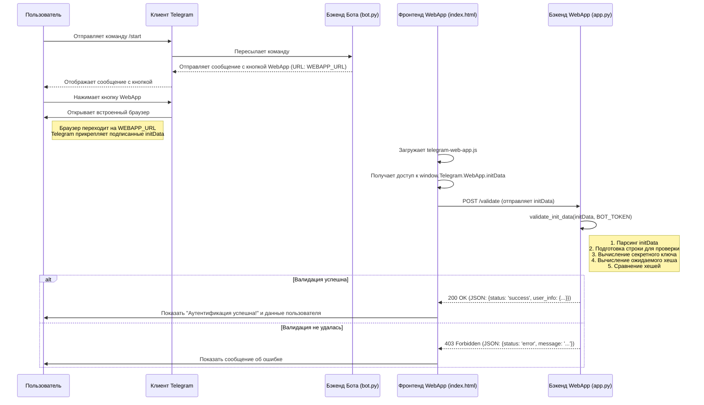
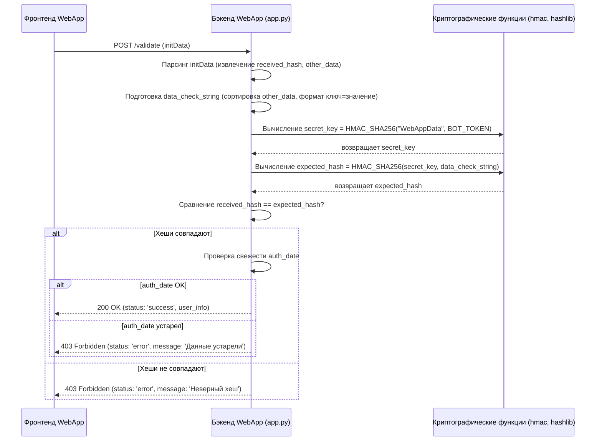

# Пример безопасной аутентификации Telegram WebApp

Этот проект демонстрирует, как безопасно аутентифицировать пользователя Telegram в веб-приложении, запускаемом из Telegram-бота с использованием механизма `WebAppInitData`.

Используются:
*   `pyTelegramBotAPI` для Telegram-бота.
*   `Flask` для простого бэкенда веб-приложения.
*   `python-dotenv` для управления переменными окружения.
*   Стандартные библиотеки Python (`hmac`, `hashlib`, `json`, `urllib`) для валидации.

## Как это работает

1.  **Взаимодействие с пользователем:** Пользователь отправляет `/start` или `/login` Telegram-боту.
2.  **Ответ бота:** Бот отвечает сообщением, содержащим встроенную кнопку с `WebAppInfo` URL, указывающим на наше веб-приложение.
3.  **Запуск WebApp:** Пользователь нажимает кнопку. Telegram открывает указанный URL во встроенном браузере и передает криптографически подписанные `initData`, содержащие информацию о пользователе.
4.  **Фронтенд (`index.html`):** Загружается веб-страница, использует библиотеку `telegram-web-app.js` для доступа к `window.Telegram.WebApp.initData` и отправляет эти данные на эндпоинт бэкенда `/validate`.
5.  **Бэкенд (`app.py`):** Приложение Flask получает `initData` на эндпоинте `/validate`. Оно выполняет проверку HMAC-SHA256, используя секретный `TELEGRAM_BOT_TOKEN`, чтобы убедиться, что данные подлинные и не были подделаны.
6.  **Результат аутентификации:** Если проверка прошла успешно, бэкенд отвечает успехом и распарсенной информацией о пользователе. Фронтенд отображает этот результат. Если проверка не удалась, возвращается ошибка 403 Forbidden.



## Настройка

1.  **Клонируйте репозиторий (или создайте файлы, как показано).**

2.  **Создайте Telegram-бота:**
    *   Поговорите с `@BotFather` в Telegram.
    *   Создайте нового бота с помощью `/newbot`.
    *   Запишите **токен HTTP API**, предоставленный BotFather.

3.  **Настройте переменные окружения:**
    *   Создайте файл с именем `.env` в корневом каталоге проекта (где находится `bot.py`).
    *   Добавьте следующие строки в `.env`, заменив заглушки:
        ```dotenv
        TELEGRAM_BOT_TOKEN="ВАШ_ТОКЕН_БОТА_ЗДЕСЬ"
        # Пример использования ngrok для локального тестирования:
        WEBAPP_URL="https://your-unique-ngrok-subdomain.ngrok-free.app"
        ```
    *   **Важно:** `WEBAPP_URL` должен быть HTTPS.

4.  **Сделайте ваше веб-приложение доступным (для локальной разработки):**
    *   Поскольку клиенту Telegram необходимо получить доступ к вашему веб-приложению через HTTPS, вам понадобится инструмент вроде `ngrok`, если вы запускаете его локально.
    *   Установите ngrok: [https://ngrok.com/download](https://ngrok.com/download)
    *   Запустите ngrok, чтобы открыть порт, на котором будет работать ваше приложение Flask (по умолчанию 5001 в `webapp/app.py`):
        ```bash
        ngrok http 5001
        ```
    *   Ngrok предоставит вам HTTPS URL для переадресации (например, `https://abcdef123456.ngrok-free.app`). Используйте этот URL в качестве `WEBAPP_URL` в файле `.env`.

5.  **Установите зависимости:**
    ```bash
    pip install -r requirements.txt
    ```

## Запуск примера

1.  **Запустите веб-приложение:**
    *   Перейдите в каталог `webapp`:
        ```bash
        cd webapp
        ```
    *   Запустите приложение Flask:
        ```bash
        python app.py
        ```
    *   Не закрывайте этот терминал.

2.  **Запустите Telegram-бота:**
    *   Откройте *новый* терминал.
    *   Вернитесь в корневой каталог проекта (если вы меняли каталог):
        ```bash
        cd ..
        ```
    *   Запустите скрипт бота:
        ```bash
        python bot.py
        ```
    *   Не закрывайте этот терминал.

3.  **Протестируйте в Telegram:**
    *   Откройте Telegram и найдите созданного вами бота.
    *   Отправьте команду `/start`.
    *   Нажмите кнопку "Open Web App 🔐".
    *   Веб-приложение должно открыться внутри Telegram, попытаться выполнить проверку и показать либо сообщение об успехе с информацией о вашем пользователе, либо сообщение об ошибке.

## Следующие шаги

После аутентификации пользователя вы можете использовать проверенную `user_info` (особенно `id`) в вашем бэкенде `webapp/app.py` для:

*   **Создания сессии:** Используйте управление сессиями Flask (или другой метод, например JWT), чтобы пользователь оставался залогиненным для последующих запросов к вашему веб-приложению в рамках этой сессии.
*   **Базы данных пользователей:** Найдите ID пользователя Telegram в базе данных вашего приложения. Если пользователь существует, залогиньте его. Если нет, вы можете предложить ему завершить процесс регистрации, связав его Telegram ID с новой или существующей учетной записью в вашей системе.
*   **Персонализации:** Используйте имя, фамилию или языковой код пользователя (если доступно в `user_info`) для персонализации опыта использования веб-приложения.
*   **API-вызовов:** Сохраните ID пользователя, чтобы связать действия, которые он выполняет в веб-приложении (например, сохранение данных), с его личностью.

Не забывайте обрабатывать потенциальные ошибки, например, когда `user_info` может отсутствовать или быть неполной, даже если проверка хеша прошла успешно.

## Примечание о безопасности: Проверка подлинности данных с помощью HMAC

Безопасность аутентификации Telegram Web App зависит от проверки того, что строка `initData`, полученная вашим бэкендом, действительно исходит от Telegram и не была подделана. Эта проверка использует **Код аутентификации сообщений на основе хеша (HMAC)**, в частности HMAC-SHA256.

Вот разбивка того, как этот процесс подтверждает происхождение и целостность данных:

1.  **Общий секрет:** Основой этой модели безопасности является ваш **`TELEGRAM_BOT_TOKEN`**. Этот токен известен *только* вам (вашему бэкенд-серверу) и Telegram. Он должен храниться в абсолютной конфиденциальности.

2.  **Подписание данных Telegram:** Когда пользователь запускает ваше веб-приложение, Telegram подготавливает строку `initData`. Перед отправкой Telegram выполняет следующие шаги:
    *   Собирает все пары ключ-значение, предназначенные для `initData`, *кроме* самого `hash`.
    *   Сортирует эти пары в алфавитном порядке по ключу (например, `auth_date=...`, `query_id=...`, `user=...`).
    *   Форматирует их в одну строку, где каждая пара находится на новой строке (`ключ=значение
ключ=значение...`). Назовем это `data-check-string`.
    *   Вычисляет секретный ключ специально для этой проверки с использованием HMAC: `secret_key = HMAC_SHA256("WebAppData", TELEGRAM_BOT_TOKEN)`.
    *   Вычисляет окончательную подпись (`hash`), снова применяя HMAC-SHA256, используя производный `secret_key` и `data-check-string`: `generated_hash = HMAC_SHA256(secret_key, data-check-string)`.
    *   Telegram прикрепляет этот `generated_hash` к `initData` под ключом `hash` и отправляет полную строку `initData` клиенту пользователя, который затем пересылает ее вашему бэкенду.

3.  **Проверка на стороне сервера (Ваш бэкенд):** Когда ваш эндпоинт `/validate` получает `initData`, он должен выполнить *точно те же шаги* для пересчета хеша:
    *   **Парсинг `initData`:** Извлечь полученный `hash` и все остальные пары ключ-значение.
    *   **Восстановление `data-check-string`:** Удалить полученную пару `hash`, отсортировать оставшиеся пары в алфавитном порядке по ключу и соединить их символами новой строки, точно соответствуя формату Telegram.
    *   **Вычисление `secret_key`:** Использовать *ваш* сохраненный `TELEGRAM_BOT_TOKEN` (общий секрет) для вычисления точно такого же секретного ключа: `secret_key = HMAC_SHA256("WebAppData", YOUR_BOT_TOKEN)`.
    *   **Вычисление ожидаемого хеша:** Вычислить хеш, используя производный `secret_key` и восстановленную `data-check-string`: `expected_hash = HMAC_SHA256(secret_key, reconstructed_data_check_string)`.
    *   **Сравнение хешей:** Критически сравнить `expected_hash`, который только что вычислил ваш сервер, с `hash`, полученным в `initData`.

4.  **Вердикт:**
    *   **Совпадение:** Если `expected_hash == received_hash`, это криптографически доказывает:
        *   **Подлинность:** Данные *должны* были исходить от Telegram для *вашего конкретного бота*. Только Telegram, зная правильный `TELEGRAM_BOT_TOKEN`, мог вычислить правильный `secret_key`, необходимый для генерации действительного `hash` для этой конкретной `data-check-string`. Злоумышленник без токена не может подделать это.
        *   **Целостность:** Данные не были изменены с тех пор, как Telegram их подписал. Любое изменение данных пользователя, `auth_date` или других полей изменило бы `data-check-string`, что привело бы к другому `expected_hash`, который *не* совпал бы с `received_hash`.
    *   **Несовпадение:** Если хеши не совпадают, данные считаются недействительными – либо они пришли не от Telegram, либо были подделаны, либо ваша логика проверки (например, форматирование строки) неверна. Ваш сервер должен отклонить запрос (например, вернуть статус 403 Forbidden).

5.  **Проверка временной метки (Предотвращение повторных атак):** Хотя HMAC подтверждает подлинность и целостность *во время подписания*, он не предотвращает повторное использование злоумышленником старой, но действительной строки `initData`. Поэтому ваш бэкенд также должен проверять поле `auth_date` (временная метка Unix) в проверенных данных. Убедитесь, что эта временная метка достаточно свежая (например, в пределах нескольких минут или часов, в зависимости от допустимых пределов вашего приложения), чтобы смягчить атаки повторного воспроизведения. Этот пример включает проверку свежести в течение одного дня в `validate_init_data` в `webapp/app.py`.

**В итоге:** Безопасность зависит от алгоритма HMAC-SHA256 и конфиденциальности вашего `TELEGRAM_BOT_TOKEN`. Успешно пересчитав тот же хеш, который сгенерировал Telegram, ваш сервер проверяет, что данные являются подлинными (от Telegram), неизмененными и связанными с вашим конкретным ботом.

### Поток проверки на бэкенде (эндпоинт `/validate`)



## Следующие шаги

После аутентификации пользователя вы можете использовать проверенную `user_info` (особенно `id`) в вашем бэкенде `webapp/app.py` для:

*   **Создания сессии:** Используйте управление сессиями Flask (или другой метод, например JWT), чтобы пользователь оставался залогиненным для последующих запросов к вашему веб-приложению в рамках этой сессии.
*   **Базы данных пользователей:** Найдите ID пользователя Telegram в базе данных вашего приложения. Если пользователь существует, залогиньте его. Если нет, вы можете предложить ему завершить процесс регистрации, связав его Telegram ID с новой или существующей учетной записью в вашей системе.
*   **Персонализации:** Используйте имя, фамилию или языковой код пользователя (если доступно в `user_info`) для персонализации опыта использования веб-приложения.
*   **API-вызовов:** Сохраните ID пользователя, чтобы связать действия, которые он выполняет в веб-приложении (например, сохранение данных), с его личностью.

Не забывайте обрабатывать потенциальные ошибки, например, когда `user_info` может отсутствовать или быть неполной, даже если проверка хеша прошла успешно.

## Примечание о безопасности

Безопасность аутентификации Telegram Web App зависит от поля `hash`, предоставленного в строке `initData`, и секретности вашего `TELEGRAM_BOT_TOKEN`. Вот почему это безопасно:

1.  **Подписание данных:** При запуске Web App Telegram генерирует уникальную строку `hash`. Этот хеш создается путем:
    *   Сбора всех других полей данных из `initData` (таких как `user`, `auth_date` и т. д.).
    *   Сортировки этих полей в алфавитном порядке по ключу.
    *   Форматирования их в определенный строковый формат (например, `ключ1=значение1
ключ2=значение2...`).
    *   Вычисления подписи HMAC-SHA256 этой строки с использованием секретного ключа, полученного из вашего `TELEGRAM_BOT_TOKEN`.

2.  **Проверка на стороне сервера:** Ваш бэкенд-сервер (`webapp/app.py` в этом примере) получает строку `initData`, включая `hash`. Для проверки ее подлинности сервер должен:
    *   **Хранить `TELEGRAM_BOT_TOKEN` в абсолютной тайне.** Он никогда не должен быть доступен на стороне клиента или в публичных репозиториях.
    *   Восстановить строку данных точно так же, как это сделал Telegram (удалив поле `hash`, отсортировав оставшиеся пары ключ-значение и соединив их символами новой строки).
    *   Получить тот же секретный ключ из `TELEGRAM_BOT_TOKEN` с использованием HMAC (`HMAC(bot_token, "WebAppData")`).
    *   Вычислить свой собственный ожидаемый хеш HMAC-SHA256, используя полученный секретный ключ и восстановленную строку данных.
    *   **Сравнить** `hash`, полученный от клиента, с хешем, вычисленным на сервере.

3.  **Целостность и подлинность:**
    *   Если хеши совпадают, это доказывает две вещи:
        *   **Подлинность:** Данные действительно исходят от Telegram для *вашего конкретного бота*, потому что только Telegram и ваш сервер (который знает секретный `TELEGRAM_BOT_TOKEN`) могли сгенерировать правильный хеш.
        *   **Целостность:** Данные не были подделаны с момента их генерации Telegram. Любое изменение полей данных привело бы к другой восстановленной строке и, следовательно, к несовпадающему хешу.

4.  **Проверка временной метки (Необязательно, но рекомендуется):** Поле `auth_date` (временная метка Unix), включенное в `initData`, следует проверять на сервере, чтобы убедиться, что запрос на проверку является недавним, предотвращая потенциальные атаки повторного воспроизведения, когда может быть повторно использована старая перехваченная строка `initData`. Этот пример включает проверку свежести (`validate_init_data` в `webapp/app.py`).

**В итоге:** Криптографическая подпись (хеш HMAC-SHA256) гарантирует, что данные пользователя, полученные бэкендом вашего веб-приложения, являются подлинными и неизмененными, при условии, что ваш `TELEGRAM_BOT_TOKEN` остается конфиденциальным. 